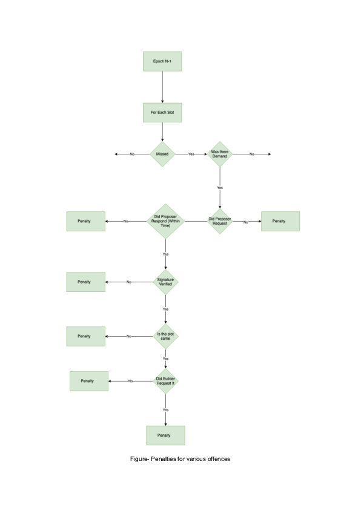

# Table of contents
- [Summary](#summary)
    - [Analytics results](#analytics-results)
- [Installation](#installation)
    - [Normal execution](#normal-execution)
    - [Interactive execution](#interactive-execution)
    - [Addendum: Installing haskell](#addendum-installing-haskell)
        - [Installing through `nix` (recommended)](#installing-through-nix-recommended)
          - [Installing `nix`](#installing-nix)
          - [Setting up the environment](#setting-up-the-environment)
          - [Freeing space](#freeing-space)
        - [Installing through GHCup](#installing-through-ghcup)
- [Explaining the model](#explaining-the-model)
    - [Assumptions made explicit](#assumptions-made-explicit)
      - [Refined type structure](#refined-type-structure)
      - [Focus on **Reporter**](#focus-on-reporter)
      - [Assumptions on reports](#assumptions-on-reports)
      - [Reporters' profit is someone else's fault](#reporters-profit-is-someone-elses-fault)
      - [Reporter has no slashing](#reporter-has-no-slashing)
      - [All actors are already registered](#all-actors-are-already-registered)
- [Code deep dive](#code-deep-dive)
    - [Recap: DSL primer](#recap-dsl-primer)
        - [The building blocks](#the-building-blocks)
        - [Exogenous parameters](#exogenous-parameters)
        - [Basic operations](#basic-operations)
        - [Branching](#branching)
        - [Supplying strategies](#supplying-strategies)
            - [Evaluating strategies](#evaluating-strategies)
            - [Stochasticity](#stochasticity)
            - [Branching](#branching-1)
    - [File structure](#file-structure)
- [Analytics](#analytics)
    - [Strategies employed in the analysis](#strategies-employed-in-the-analysis)
    - [Reading the analytics](#reading-the-analytics)
    - [Running the analytics](#running-the-analytics)
    - [Main findings](#main-findings)
      - [Other analyses](#other-analyses)
      - [Sanity checks](#sanity-checks)


# Summary
[TODO]


## Analytics results
[TODO]


# Installation
To run the model, it is necessary to have `haskell` and `stack` installed on your machine. Refer to the subsection [Addendum: Installing haskell](#addendum-installing-haskell) for instructions. A deeper dive into the code structure can be found in the [Code deep dive](#code-deep-dive) subsection.

There are two main ways of running the model: normal and interactive execution.


## Normal execution
To 'just' run the model, type

```sh
stack run
```
in the main directory, where the file `stack.yaml` is located.
The model will be compiled and a predefined set of analytics will be run. The results of the predefined analytics will be shown on terminal.


## Interactive execution
One of the most powerful features of `haskell` is *REPL mode*. This allows you to recompile the code on the fly, to query the type of a function and a lot of other things. To start interactive mode, just run

```sh
stack ghci
```

in the main directory. The code will compile, and then an interactive terminal (REPL) window will open. There are various commands that can be fed to the REPL. Among the most useful ones we highlight:

| Command         | Description               |
|:----------------|--------------------------:|
| `:q`            | quit interactive mode     |
| `:r`            | recompile the source code |
| `:l module`     | load module               |
| `:t expression` | query expression type     |

Of these commands, `:t` is the most important one, as it allows to visualize clearly what type of input we must feed to a given function. For instance, `:t (&&)` produces the output:

```haskell
(&&) :: Bool -> Bool -> Bool
```
Which tells us that `(&&)` - the logical `and` operator - takes a boolean (a truth value), then another boolean, and returns a boolean (the logical `and` of the first two).

Since under the hood games are nothing more than functions, REPL allows us to see the game type by doing `:t gameName`. If the game is parametrized, say, over a string, then `:t gameName "string"` will return the type where the first component has already been filled.

This tool is expecially powerful to better understand the structure of the strategies we have to feed to the model, which can grow very complicated as the model scales.


## Addendum: Installing haskell

If you dont' have either `haskell` or `stack`, it is necessary to install them. There are many ways to do so, of which we propose two: The first one, which we recommend, is through the [`nix`](https://nixos.org/download.html) package manager. The second one, is via [`GHCup`](https://www.haskell.org/ghcup/).

### Installing through `nix` (recommended)

[`nix`](https://nixos.org/download.html) is a package manager that allows to build environments deterministically. This means that it offers the right granularity to set up a developing environment exactly as one wants it. All of our projects get shipped together with something called a *`nix` flake*, which is a set of instructions telling `nix` to install all needed dependencies precisely at the version we used during development. This drastically reduces the possibility of compiling/execution errors and it is why we strongly recommend using `nix`.

#### Installing `nix`

To install `nix`, follow the [official instructions](https://nixos.org/download.html) for your operating system. Please note that on windows this will require installing [WSL2](https://en.wikipedia.org/wiki/Windows_Subsystem_for_Linux) first. 

`nix` flakes require enabling experimental features to work properly. To do so in a Unix-based system, type the following commands in a terminal:

```sh
mkdir -p ~/.config/nix
echo "experimental-features = nix-command flakes" >> ~/.config/nix/nix.conf
```

On other operating systems the procedure may be different.

#### Setting up the environment

Now that `nix` is up and running, we can fire up the environment. In a terminal, navigate in the main repo folder, where `flake.nix` is. Before running any command, type

```sh
nix develop
```

This will create a reproducible ephemeral devshell exposing all the required dependencies for running the project (slack, ghc, haskell-language-sever). Please note that this will take around 7GB of space.

While in the devshell, you can proceed as in [Normal execution](#normal-execution) and [Interactive execution](#interactive-execution). When you're done trying out the model, you can type

```sh
exit
```

or close the terminal window to exit from the devshell.

#### Freeing space

If you do not plan to use the model in the foreseeable future and want to reclaim some hard-disk space, in a terminal (outside the `nix develop` environmnet) just give:

```sh
nix-collect-garbage
nix store optimise
```

### Installing through `GHCup`

Another way to set up the environment to run the project is via [`GHCup`](https://www.haskell.org/ghcup/).
In a terminal, type:

```sh
 curl --proto '=https' --tlsv1.2 -sSf https://get-ghcup.haskell.org | sh 
```

If asked, respond 'yes' (`Y`) to the following questions:

```
Do you want to install haskell-language-server (HLS)?
Do you want to enable better integration of stack with `GHCup`?
```

Afterwards, `GHCup` may ask you to install some additional packages before continuing with the installation. Follow the advice before continuing. Then, just follow the instructions through the end.

Again, the installation is quite massive in terms of space. In this respect, `GHCup` is a convenient solution in that it installs only in one folder (on Linux systems, `/home/$USER/.ghcup`). Should you decide to get rid of `haskell` altogether, just delete the folder.

Again, once `GHCup` has installed, you can proceed as in [Normal execution](#normal-execution) and [Interactive execution](#interactive-execution).

**A note of warning:** GHC, the `haskell` compiler installed with `GHCup`, relies heavily on the GCC compiler. GHC assumes that GCC comes together with all the relevant libraries. As such, in compiling the model you may get errors such as:

```sh
/usr/bin/ld.gold: error: cannot find -ltinfo
```

these errors hint at missing GCC libraries, which will have to be installed independently. The precise iter to do so depends on the libraries involved and on your operating system. Unfortunately there is little we can do about it, as this is a problem with the general `haskell` developer infrastructure.

The main way to avoid this is by using the recommended installation via [`nix`](#installing-through-nix-recommended).


# Explaining the model

Our modelling task for this job was articulated towards modelling and analyzig some parts of the *Proof of Neutrality* (often shortened as *PoN*) protocol. PoN is a protocol to coordinate block proposers, builders a relayer in such a way that
- Is censorship resistant;
- Keeps Relayers 'blind', meaning that a Relayer has no knowledge of the block contents it relays and, as such, gain a legal advantage
- Smooths MEV profits of all participants: Indeed, participants are paid on a weekly basis even if they do not build or propose blocks. This is somehow akin to mining pools, that smooth mining profits among a group of miners sharing their computational resources.

To work, PoN has various actors:
- **Validator**, which examines a proposed block. If the block is valid, then it gets added to the chain.
- **Proposer** is the elected block proposer from the set of **Validator**s, in the sense of Ethereum PBS. For our purposes, **Proposer** is just an actor having the right to propose a block at a given time. This block will then be verified by the set of Ethereum **Validator**s and added to the chain if valid. **Proposer** does not build the block itself, but auctions away its blockspace to builders.
- **Builder** is a block builder, in the sense of Ethereum PBS. A builder bids for blockspace offered by **Proposer**. If a given **Builder** wins the auction, it earns the right of proposing a block, and to extract the MEV resulting from it (transaction fees, arbitrage opportunities and so on and so forth).
- **Relayer** relays information between **Proposer** and **Builder**. The role of **Relayer** is made complicated by the fact that PBS must be trustless: If **Builder** discloses block information too soon, for instance, this information may be stolen by **Proposer** which could use it to create the block itself. There are various mechanisms being proposed to avoid this outcome, but this is out of the scope of this documentation, as it is the fact that **Relayer** may or may not have legal responsibility over the content it relays to PBS actors, depending on how PBS is implemented.

All these three roles are not specific to PoN. Indeed, for instance, **Proposer** can choose to run 'solo' or to join PoN. For this reason, a registry of registered proposers, builder and relayers must be maintained to keep track of who is using PoN. Moreover, PoN has an additional specific role:

- **Reporter** is a role that profits from other actors' misbehavior: As PoN is trustless, the right incentives have to be provided so that it is in the best interest of all participants to behave as the protocol prescribes. Should some actor behave badly (e.g. **Builder** does not provide a block after having won the auction for blockspace), **Reporter** can fill in a report providing evidence of this misbehavior, and receive a reward for it. **Reporter** must also join a registry.

All these actors are coordinated by the *Payout Pool*, which is a set of on-chain contracts determining, among other things, the payment flow for all actors and the registries for proposers, builders, relayers and reporters.

All this has been formalized in the document ['Model of Payout Pool'](https://docs.google.com/document/d/1nPLk06y5zIzsRomPDFLE-uIX70EmL6hRXikR6lgR8yU/edit#heading=h.er7agg4s96ij) provided by BlockSwap, which we used as the main blueprint for this model.

Our task was about focusing on the **Reporter** role. In particular, we were tasked to understand if the incentives for **Reporter** were well-aligned.


## Assumptions made explicit

In modelling PoN reporter behavior, we had to make a few assumptions explicit. We list them below.

### Refined type structure

The first thing one can notice is that, in comparison with other models, in this project we made a heavy use of a refined type structure. This can be found in `Types.hs` - see [File structure](#file-structure) for more information.

The reason for this is that the PoN reporter mechanism is spelled out in great detail and resembles an automaton: The actions that **Reporter** can take depend on the current state of the protocol. As such, we encapsulated all the possible actors (**Validator**, **Proposer**, **Builder**,  **Reporter**), states (payments, blocks, builder and relay actions, etc.), report prerequisites (slot missed, etc.) and report types (same slot etc.) into custom types. In doing so, we will profit from the type discipline enforced by the type checker, which hopefully will limit the amount of conceptual mistake we can do while modelling.

### Focus on **Reporter**

As our task was focused around modelling and analyzing the **Reporter** role, we modelled the Payout Pool and all the other roles (**Validator**, **Proposer**, **Builder**, **Relayer**) only to the extent necessary to analyze and study **Reporter** actions. In particular, *these other roles are not taken to be strategic players at the moment.* As our model is fully compositional, it can be extended at a latter stage to fully simulate other parts of PoN.

### Assumptions on reports

The main action that **Reporter** can take is submitting a report. We assumed that:
- All reports are verified, meaning that it can be always detected when **Reporter** submits false information in a report.
- We assumed that all reports are verified on-chain by means of smart contracts. For what concerns our model, this means that we assumed that the procedure to verify a report is deterministic, and does not depend on the whims of any particular actor: The veracity of a report can always and unambiguously be attested, without the need need to reach a consensus around it.
- We assumed that reports are verified immediately as they are submitted.
- We assumed that the effects of a report are immediate. We are aware of the fact that this assumption is wrong when the whole PoN model is considered, but as we aren't modelling any actor other than **Reporter** as strategic, this does not constitute a problem at the moment.
- We assumed that the reward for **Reporter** is the same for different kinds of misbehavior. By looking at ['Model of Payout Pool'](https://docs.google.com/document/d/1nPLk06y5zIzsRomPDFLE-uIX70EmL6hRXikR6lgR8yU/edit#heading=h.er7agg4s96ij), we noticed that different types of misbehavior are causally linked. By this we mean that, for instance, to report a missing reply by **Proposer** (that is, when **Proposer** should reply to **Relayer** with its signature), it must first be verified that **Proposer** requested a block. The causal order in which penalties can be given is defined in the following image:



A consequence of this is that **Reporter** cannot report a misbehaviour for step $i$ if PoN has not been followed for any step from $0$ to $i-1$. As the rewards are assumed to be the same, **Reporter** should be indifferent to this. Things may change however if different kinds of report bear different payoffs. We did not investigate this possibility as we assumed the reporting order to be fixed as in the image above.

### Reporters' profit is someone else's fault

By this we mean that, if every other actor follows the protocol, there will be nothing to report. Hence, the Reporters' profit is interely dependent on some other actors' misbehavior.

### Reporter has no slashing

This has been one of the most contentious points so far. As PoN is defined, **Reporter** must supply no collateral to PoN, not in the form of staked capital, nor in the form of fees. This means that **Reporter** cannot be penalized by PoN for reporting untruthfully. So, we assumed no negative payoffs for **Reporter** in case of invalid reporting.

In doing so, we did not take into account the fact that, if reports happen on-chain, **Reporter** must pay gas fees to submit a report. This could be effectively accounted as a negative payoff. In any case, such occurrence must be dealt with carefully, as, for instance, in the case of **Reporter** being the **Builder** submitting the next block. In this case, **Reporter** could include transactions in the block for free, effectively gaining the right of reporting untruthfully without consequences.

### All actors are already registered

We assumed that all actors are already in the PoN registry at report time.


# Code deep dive


## Recap: DSL primer

Our models are written in a custom DSL compiled to `haskell`. Here we give a brief description of how our software works.

### The building blocks

The basic building block of our model is called **open game**, and can be thought of as a game-theoretic lego brick. This may represent a player, a nature draw, a payoff matrix or a complex combination of these elements. It has the following form:

```haskell
gameName variables = [opengame|

   inputs    : a;
   feedback  : b;

   :----------------------------:

   inputs    : a';
   feedback  : b';
   operation : content;
   outputs   : s';
   returns   : t';

   :----------------------------:

   outputs   :  s;
   returns   :  t;
  |]
```

We can imagine this block as a box with 4 wires on its outside, on which travels information marked as:
- `inputs`, data that gets fed into the game (e.g. a player receiving information from a context).
- `outputs`, data that the game feeds to the outside world (e.g. a player communicating a choice to another player).
- `returns`, the returns of a player actions, which are usually directly fed to a function calculating payoffs.
- The `feedback` wire which sends information back in time. If, intuitively, `returns` represents the returns on a player action, one could imagine it as 'information that an agents receive from the future'. `feedback` is the dual analog of that: If a given piece of information comes from the future, someone in the future must have been sent it to the past. For additional details about the `feedback` wire please refer to the relevant [literature](https://arxiv.org/abs/1603.04641).

The `:--:` delimiters separate the outside from the inside of the box. As one can see, the interfaces inside are replicated. This is intentional as it allows for a notion of *nesting*. For instance, the situation depicted in the following picture:


Can be represented by the following code block:

```haskell
gameName variables = [opengame|

   inputs    : a, a';
   feedback  : b;

   :----------------------------:

   inputs    : a';
   feedback  : ;
   operation : SubGame1;
   outputs   : x;
   returns   : t';

   inputs    : a, x;
   feedback  : b;
   operation : SubGame2;
   outputs   : s;
   returns   : t;
   :----------------------------:

   outputs   :  s;
   returns   :  t,t';
  |]
```

In turn, `Subgame1` and `Subgame2` can be other games defined using the same DSL. Notice that the wire `x` is internal and totally hidden from the 'outside world'. 

### Exogenous parameters

An exogenous parameter is a given assumption that is not part of the model, and is fed to it externally. As such, it is treated by the model as a 'fact' that cannot really be modified. An example of exogenous parameter could be the market conditions at the time when a game is played.

Exogenous parameters are just defined as variables, as the field `variables` in the previous code blocks testifes. These variables can in turn be fed as exogenous parameters to inside games, as in the following example:

```haskell
gameName stock1Price stock2Price  = [opengame|

   inputs    : a, a';
   feedback  : b;

   :----------------------------:

   inputs    : a';
   feedback  : ;
   operation : SubGame1 stock1Price;
   outputs   : x;
   returns   : t';

   inputs    : a, x;
   feedback  : b;
   operation : SubGame2 stock2Price;
   outputs   : s;
   returns   : t;
   :----------------------------:

   outputs   :  s;
   returns   :  t,t';
  |]
```

### Basic operations

In addition to the DSL defining the 'piping rules' between boxes, we provide some *basic operations* to populate a box, namely:
- A *function*, which just transforms the input in some output.
- A *stochastic distribution*, used to implement draws from nature.
- A *strategic choice*, which can be thought of as a function parametrized over strategies.

### Branching

Another important operation we provide is called *branching*. This is useful in contexts where, say, a player choice determines which subgame is going to be played next.
Branching is represented using the operator `+++`. So, for instance, if `SubGame1` is defined as ```branch1 +++ branch2```, then we are modelling a situation where `SubGame1` can actually evolve into two different games depending on input. As the input of a game can be the outcome of a strategic choice in some other game, this allows for flexible modelling of complex situations.

Graphically, branching can be represented by resorting to [sheet diagrams](https://arxiv.org/abs/2010.13361), but as they are quite complicated to draw, this depiction is rarely used in practice.

### Supplying strategies

As usual in classical game theory, a strategy conditions on the observables and assigns a (possibly randomized) action. 

Every player who can make a decision in the game needs to be assigned a strategy. These individual strategies then get aggregated into a list representing the complete strategy for the whole game.

So, for instance, if our model consists of three subgames, a strategy for the whole model will just be a list:

```haskell
`strGame1 ::- strGame2 ::- strGame3 ::- Nil`.
```

#### Evaluating strategies

To evaluate strategies, it is enough to just run the `main` function defined in `app/Main.hs`. This is precisely what happens when we give the command `stack run`. In turn, `main` invokes functions defined in `Analytics.hs` which define the right notion of equilibrium to check. If you want to change strategies on the fly, just open a REPL (cf. [Interactive Execution](#interactive-execution)) and give the command `main`.
You can make parametric changes or even define new strategies and/or notions of equilibrium by editing the relevant files (cf. [File structure](#file-structure)). Once you save your edits, giving `:r` will recompile the code on the fly. Calling `main` again will evaluate the changes.

#### Stochasticity

Our models are Bayesian by default, meaning that they allow for reasoning in probabilistic terms.

Practically, this is obtained by relying on the [Haskell Stochastic Package](https://hackage.haskell.org/package/stochastic), which employs monadic techniques.

A consequence of this is that deterministic strategic decisions (e.g. 'player chooses option A') must be lifted into the stochastic monad, getting thus transformed into their probabilistic equivalent (e.g. 'of all the options available, player chooses A with probability 1')

A practical example of this is the following:

```haskell
strategyName
  :: Kleisli
       Stochastic
       (Parameter1, Parameter2)
       Decision
strategyName = pureAction Decision1
```

In the example above, the player observes some parameters (`Parameter1` and `Parameter2` in this particular case), and then must assign an action (in this case `Decision1`).

`pureAction` lifts the deterministic choice `Decision1` to the corresponding concept in the probabilistic realm. 

The upside of assuming this little amount of overhead is that switching from pure to mixed strategies can be easily done on the fly, without having to change the model beforehand.

#### Branching

As a word of caution notice that, in a game with branching, we need to provide a possible strategy for each branch. For example, suppose to have the following game:

- `Player1` can choose between options $A$ and $B$;
    - case $A$: `Player2` can choose between options $A_1$ or $A_2$;
    - case $B$: `Player2` can choose between options $B_1$ or $B_2$;

Moreover, suppose that the payoffs are structured as follows: 

- If `Player1` chooses $A$, and then `Player2` chooses $A_1$, then both players get $100$.
- In any other case, both players get $0$.

In this game the best strategy is clearly $(A,A_1)$. Nevertheless, we need to supply a strategy for `Player2` also in the '$B$' branch: Even if `Player1` will never rationally choose option $B$, `Player2` needs to be endowed with a strategic choice between $B_1$ and $B_2$ in case this happens.


## File structure

The model is composed of several files:

- The `app` folder contains `Main.hs`, where the `main` function is defined. This is the function executed when one gives `stack run`. `main` executes equilibrium checking on some of the most interesting strategies defined in the model. We suggest to start from here to get a feel of how the model analysis works (cf. [Running the analytics](#running-the-analytics) and [Evaluating strategies](#evaluating-strategies)).
- The `pics` folder exists only for the purpose of this documentation file.
- The `test` folder is for basic Haskell testing code. Here 'test' has to be intended in the traditional development sense, that is, these are tests to check that the code works properly, and aren not about model analytics. At the moment we did not implement any tests on the codebase, since the helper functions employed in the code are not particularly complicated.

The code proper is contained in the `src` folder:
- `ActionSpaces.hs` defines, for each game, the type of possible strategic decision that can be taken in the game. So, for instance, if we had a game where an actor could decide between lying and telling the truth, the action space would be defined as `[Lie, TellTheTruth]`. Defining action spaces is important because they set very precise boundaries in which strategies can be defined.
- `Analytics.hs` defines the equilibrium notion for each game we want to test. In most cases, the equilibrium notion we use is simple Nash Equilibrium.
- `Components.hs` is where the subgames making up the whole model are defined.
- `Model.hs` is the file where the subgames are assembled and the main model is defined.
- `Parametrization.hs` defines the concrete parametrizations used for the analysis. This comprises all the parameters defining the initial state of the model, as for instance may be players' initial endowments, weights in a payoff matrix, fixed costs to perform some operations, etc.
- `Payoffs.hs` is where the payoff functions used in every (sub)game are defined. These are the functions that determine how players are rewarded for their actions. We decided to keep them all in the same file to make tweaking and fine-tuning less dispersive.
- `PayoutPoolFunctionality.hs` Contains the main logic of the payout pool, as far as it concerns the reporter.
- `Strategies.hs` is where the strategies we want to test are defined. Strategies for each game must lie within the bounds set in `ActionSpaces.hs`.
- `SupportFunctions.hs` is where we define some plain-Haskell functions that are going to be used in the model, e.g. functions to deterministically transform payoffs, functions to be used to populate the core of a fully deterministic, non-strategic game etc.
- `Types.hs` is where we define the types for the main ingredients of the model. As models can grow very complex, enforcing some type discipline either by means of simple type-aliasing or by defining new data types altogether is very useful to prevent ill-defined code.

Relying on the DSL Primer, parsing the code structure should be a manageable task.

All the code lives in a unique branch, named `main`.


# Analytics

Now, we switch focus on *analytics*, which we defined as the set of techniques we employ to verify if and when a supplied strategy results in an *equilibrium*. The notion of *equilibrium* we rely upon is the one of [Nash equilibrium](https://en.wikipedia.org/wiki/Nash_equilibrium), which intuitively describes a situation where, for each player, unilaterally deviating from the chosen strategy results in a loss.


## Reading the analytics

Analytics in our model are quite straightforward. In case a game is in equilibrium, the terminal will print `Strategies are in equilibrium`.

For games with branching, there will also be a `NOTHING CASE`. To understand this, consider a game (call it `First Game`) that can trigger two different subgames (`Subgame branch 1`, `Subgame branch 2`, respectively) depending on the player's choice. Analytics would read like this:

```
 Game name
First Game:

 Strategies are in equilibrium
Subgame branch 1:

 NOTHING CASE
Subgame branch 2:

 Strategies are in equilibrium
```

Here `NOTHING CASE` signifies that the choice provided by the player results in not visiting `Subgame branch 1`, which is thus never played in this senario: Evidently, the choice made by the player in `First Game` resulting in the play continuing on `Subgame branch 2`.

On the contrary, analytics become more expressive when the game is *not* in equilibrium. In this case, the engine will suggest a more profitable deviation by displaying the following prompt:

```
Strategies are NOT in equilibrium. Consider the following profitable deviations: 

Player: 
Optimal Move: 
Current Strategy:
Optimal Payoff: 
Current Payoff: 
Observable State:
 --other game-- 
 --No more information--
```

`Observable State` contains a dump of all the game parameters that are currenlty observable by all players. This is usually a lot of information, mainly useful for debugging purposes. All the other field names are pretty much self-describing. 


## Strategies employed in the analysis

As detailed in [File structure](#file-structure), the strategies above reside in `Strategies.hs`. For more information about how to supply strategies and/or how to make changes, please refer to the section [Supplying Strategies](#supplying-strategies).

The main strategies we give are the following strategy tuples:

```haskell
-- Full reporter strategy
fullStrategyHonest =
  grievingStrategy
  ::- missingRequestStrategy
  ::- missingReplyStrategy1
  ::- missingReplyStrategy2
  ::- missingReplyStrategy3
  ::- missingRequestBuilder1
  ::- missingRequestBuilder2
  ::- lowPaymentBuilder
  ::- kickingStrategy
  ::- submitReportStrategy
  ::- Nil

-- Full reporter strategy when report wrong 
fullStrategyFalse =
  grievingStrategy
  ::- missingRequestStrategy
  ::- missingReplyStrategy1
  ::- missingReplyStrategy2
  ::- missingReplyStrategy3
  ::- missingRequestBuilder1
  ::- missingRequestBuilder2
  ::- lowPaymentBuilder
  ::- kickingStrategy
  ::- submitFalseReportStrategy
  ::- Nil
```

The former is a honest strategy, whereas the latter is a strategy that submits a false report. As one can see, the two strategy tuples differ only in the strategy for the very last subgame. These two are defined as follows:

```haskell
submitReportStrategy ::
  Kleisli
     Stochastic
     (State, SlotID, ProposerAddr, BuilderAddr, PenaltyReport PenaltyType, PenaltyReport PenaltyType)
     (SubmitReport Report)
submitReportStrategy =
  Kleisli (\(_,slotId,proposerAdr',builderAdr',report,kickingReport) ->
             case report of
                NoPenalty ->
                  case kickingReport of
                     NoPenalty -> playDeterministically NoReport
                     Penalty x -> playDeterministically $ matchPenaltyForReport slotId proposerAdr' builderAdr' x
                Penalty x -> playDeterministically $ matchPenaltyForReport slotId proposerAdr' builderAdr' x
          )

submitFalseReportStrategy ::
  Kleisli
     Stochastic
     (State, SlotID, ProposerAddr, BuilderAddr, PenaltyReport PenaltyType, PenaltyReport PenaltyType)
     (SubmitReport Report)
submitFalseReportStrategy =
  Kleisli (\(_,slotId,proposerAdr',builderAdr',_,_) ->
                let report = Report
                        { _proposer = proposerAdr'
                        , _builder  = builderAdr'
                        , _amount   = 0
                        , _slotId   = 1
                        , _blockId  = 0
                        , _penaltyType = Validator
                        }
                in playDeterministically $ SubmitReport report
          )
```
As one can see, the former verifies if any actor is at fault before submitting the report. Notably, if every actor involved behaves honestly, `submitReportStrategy` opts for not reporting anything. On the contrary, `submitFalseReportStrategy` always submits a 'hardcoded' report, without checking if it actually reflects a real situation.

All the other strategies in the tuple (`missingRequestStrategy`,`missingReplyStrategy1`, `missingReplyStrategy2`, `missingReplyStrategy3`, `missingRequestBuilder1`, `missingRequestBuilder2`, `lowPaymentBuilder`, `kickingStrategy`) check if some actor in the protocol is at fault. The information resulting from these strategies is aggregated in `submitReportStrategy` and `submitFalseReportStrategy` by `matchPenaltyForReport`, which is defined in `SupportFunctions.hs`.


## Running the analytics

As already stressed in [Evaluating strategies](#evaluating-strategies), there are two main ways to run strategies. In the [Normal execution](#normal-execution) mode, one just needs to give the command `stack run`. This command will execute a pre-defined battery of strategies using the parameters predefined in the source code. These parameters can be varied as one pleases. Once this is done and the edits are saved, `stack run` will automatically recompile the code and run the simulation with the new parameter set.

In the [Interactive execution](#interactive-execution) mode, the users accesses the repl via the command `stack ghci`. Here one can run single functions by just calling them with the relevant parameters, as in:

```haskell
functionName parameters
```

In particular, calling the function `main` in interactive mode will result in the same behavior of calling `stack run` in normal mode. Again, editing the source code and then hitting `:r` will trigger recompilation on the fly.


## Main findings
[TODO]

### Other analyses
[TODO]

### Sanity checks
[TODO]